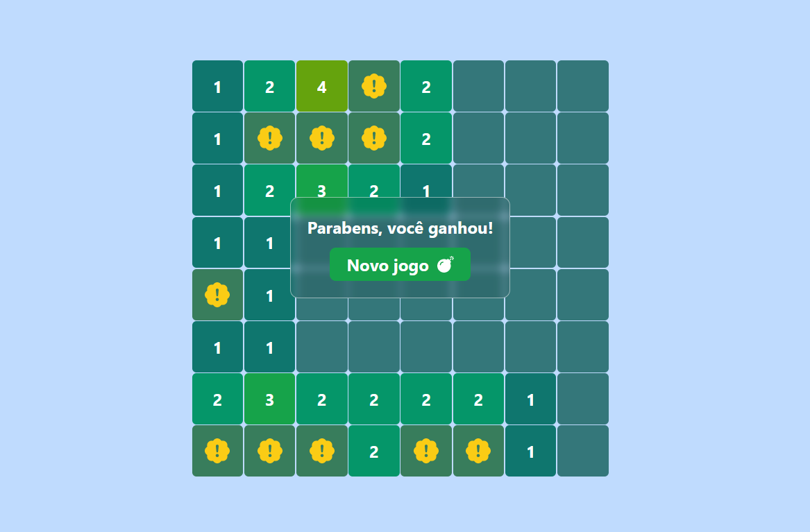

# Campo minado

Este é um projeto do jogo bastante conhecido como campo minado (minesweeper).



## Como funciona esse "campo minado"?

O tabuleiro tem várias peças que inicialmente estão ocultas e você clica para revelá-las. Algumas bombas estão escondidas nas peças ocultas e o objetivo é revelar todas as peças que não são bombas.

O jogo tem algumas poucas regras:

1. Clique nas peças para revelá-las;
2. Cada peça pode ter ou não bombas;
3. Ao revelar peças que possuem bombas, você perde;
4. Ao revelar peças que não possuem bombas, pode ter ou não um número;
5. O número que aparece representa a quantidade de bombas existentes nas peças vizinhas (incluindo as peças nas diagonais);
6. Peças reveladas que não possuem números revelam todas as peças vizinhas (incluindo as peças nas diagonais) automaticamente.

<br>

## Detalhes do projeto

Basicamente, este projeto utiliza as 3 seguintes tecnologias:
- [React.js](https://reactjs.org/)
- [TypeScript](https://www.typescriptlang.org/)
- [TailwindCSS](https://tailwindcss.com/)

Outro detalhe sobre o projeto é que possui 3 níveis: fácil, intermediário e difícil. O que varia entre esses três é que quanto maior a dificuldade, maior a quantidade de bombas e de peças totais.

<br>

## Como visualizar o projeto online

Para abrir o projeto em funcionamento, ele está hospedado no próprio Github Pages. [Clique aqui para acessar a página da aplicação online](https://hennanlewis.github.io/campo-minado/).

<br>

## Como executar o projeto na sua máquina

1. Após clonar o repositório, o seguinte código instala as dependências necessárias:

```shell
yarn
```

Caso tenha preferência pelo `npm` como gerenciador de pacotes, utilize:

```shell
npm install
```

2. Após a finalização da instalação das dependências necessárias, o seguinte código executa a aplicação:

```shell
yarn dev
```

ou caso tenha preferência pelo `npm` como gerenciador de pacotes:

```shell
npm run dev
```

- Caso a aplicação não abra automaticamente no navegador, abra [http://127.0.0.1:5173](http://127.0.0.1:5173) no navegador.

3. Para parar a aplicação, pressione `ctrl+c` no terminal de execução do projeto.